# System Architecture — jshutter

This document describes the software design, execution flow, components, and design decisions of **jshutter**. Its goal is to provide developers and contributors with a clear view of how the engine works under the hood.

---

## 1. Modular Architecture Diagram

The following diagram details the interaction between the system's subcomponents from highest to lowest level:

```mermaid
graph TD
	subgraph 1["CLI & Bootstrapping Layer"]
		1__cli["[src/cli.ts] CLI Entry Point"]
		1__run["[src/commands/run.ts] Execution Orchestrator"]
		1__validate["[src/commands/validate.ts] Static Validator"]
		1__init["[src/commands/init.ts] Project Initializer"]
		1__install["[src/commands/install-skill.ts] Skill Installer"]
		1__open["[src/commands/open-report.ts] Report Opener"]
		1__version["[src/version.ts] Package Version Reader"]
		1__update["[src/update-checker.ts] NPM Update Notifier"]

		1__cli -->|"Parses args and delegates to run"| 1__run
		1__cli -->|"Delegates to validate"| 1__validate
		1__cli -->|"Delegates to init"| 1__init
		1__cli -->|"Delegates to install-skill"| 1__install
		1__cli -->|"Delegates to open-report"| 1__open
		1__cli -->|"Reads package version"| 1__version
		1__cli -->|"Registers preAction hook"| 1__update
	end

	subgraph 2["Configuration & Resolution Core"]
		2__loader["[src/config/loader.ts] Parser & Env Interpolator"]
		2__act_res["[src/config/action-resolver.ts] Actions & Macro Resolver"]
		2__url_res["[src/config/url-resolver.ts] Path & URL Resolver"]
		2__vp_res["[src/config/viewport-resolver.ts] Viewport Expansion & Dedup"]
		2__presets["[src/config/presets.ts] Viewports Presets Catalog"]

		2__loader -->|"Resolves actions and reads macro .js files"| 2__act_res
		2__loader -->|"Resolves absolute URLs with baseUrl"| 2__url_res
		2__loader -->|"Expands viewports mapping presets to dimensions"| 2__vp_res
		2__vp_res -->|"Reads preset dimensions"| 2__presets
	end

	subgraph 3["Browser Execution Engine"]
		3__engine["[src/engine.ts] Concurrency Worker Scheduler"]
		3__runner["[src/engine/task-runner.ts] Context Sandbox Executor"]

		3__engine -->|"Spawns workers and queues parallel execution"| 3__runner
	end

	subgraph 4["Browser Interactions Pipeline"]
		4__dispatcher["[src/actions/index.ts] Actions Dispatcher Registry"]
		4__handlers["[src/actions/*] Interaction Unit Handlers"]

		4__dispatcher -->|"Dispatches all 17 action types to handlers"| 4__handlers
	end

	subgraph 5["Reports & Serialization"]
		5__json["[src/reporter/json-reporter.ts] JSON Report Writer"]
		5__html["[src/reporter/html-reporter.ts] Interactive HTML Compiler"]
	end

	1__run -->|"Loads and parses configuration"| 2__loader
	1__run -->|"Runs checkGitIgnore safety check"| 1__run
	1__run -->|"Reads package version"| 1__version
	1__run -->|"Initializes Playwright engine"| 3__engine
	3__runner -->|"Navigates page and dispatches actions"| 4__dispatcher
	3__runner -->|"Captures physical PNG/JPEG screenshot"| 3__runner
	1__run -->|"Consolidates and sanitizes JSON results"| 5__json
	1__run -->|"Consolidates, embeds assets and sanitizes HTML results"| 5__html
	5__json -->|"Obfuscates passwords and sensitive tokens"| 5__json
	5__html -->|"Obfuscates passwords and sensitive tokens"| 5__html

	6__types["[src/types.ts] Core Type Definitions"]
	4__dispatcher -->|"Imports ActionConfig, ActionContext, ActionHandler"| 6__types
	2__vp_res -->|"Imports ViewportConfig, ViewportTarget, ResolvedViewportInfo"| 6__types
	2__loader -->|"Imports SharedConfig, TaskConfig"| 6__types
```



---

## 2. Detailed Execution Flow

1.  **CLI Entry Point**: [src/cli.ts](./src/cli.ts) parses command-line arguments (using Commander) and registers a `preAction` hook that runs [src/update-checker.ts](./src/update-checker.ts) to check for newer versions on npm.
2.  **Configuration Resolution**: [src/config/loader.ts](./src/config/loader.ts) loads the JSON file, performs recursive `$env.` environment variable interpolation in plain text, validates types, and delegates responsive viewport expansion to [src/config/viewport-resolver.ts](./src/config/viewport-resolver.ts) (which maps preset names to dimensions and deduplicates resolutions).
3.  **Security Check**: [src/commands/run.ts](./src/commands/run.ts) asynchronously checks via the internal `checkGitIgnore` function whether session state storage files are registered in the project's `.gitignore`, printing a non-blocking warning if they are not.
4.  **Initialization & Concurrency**: [src/engine.ts](./src/engine.ts) configures the concurrent priority queue (worker pool) and manages parallel thread limits.
5.  **Sequential Phase (`setupTasks`)**: The Playwright engine processes the `setupTasks` block one by one using [src/engine/task-runner.ts](./src/engine/task-runner.ts) to prepare cookies/localStorage and save the context via the `saveStorageState` option.
6.  **Concurrent Phase (`tasks`)**: The engine spawns parallel threads to capture the `tasks` block via [src/engine/task-runner.ts](./src/engine/task-runner.ts), loading the common `storageState` session state.
7.  **Action Executor**: [src/actions/index.ts](./src/actions/index.ts) sequentially dispatches each interactive command defined in the task, delegating to the individual modules in [src/actions/](./src/actions/).
8.  **Report Generator**: Upon completion, execution data is consolidated and sanitized through [src/reporter/json-reporter.ts](./src/reporter/json-reporter.ts) and [src/reporter/html-reporter.ts](./src/reporter/html-reporter.ts).

---

## 3. Component Structure

### A. Configuration Layer (`src/config/`)
*   **[loader.ts](./src/config/loader.ts)**: Loads the JSON, applies recursive environment variable interpolation, and orchestrates the secondary resolvers.
*   **[action-resolver.ts](./src/config/action-resolver.ts)**: Validates task action sequences. If an action is of type `macro`, it reads the `.js` file from disk and maps its contents to the `script` property for evaluation. It also resolves relative URLs in `navigate` actions.
*   **[url-resolver.ts](./src/config/url-resolver.ts)**: Resolves absolute or relative URLs (using the global `baseUrl`) and computes output names with responsive suffixes.
*   **[viewport-resolver.ts](./src/config/viewport-resolver.ts)**: Resolves viewport configurations from tasks and global settings, maps preset names to dimensions, deduplicates resolutions, and falls back to a default viewport (1280x720) when none is specified.
*   **[presets.ts](./src/config/presets.ts)**: Catalog of built-in viewport presets (mobile-s, mobile, mobile-l, tablet, tablet-l, desktop, desktop-hd, desktop-2k).

### B. Execution Engine Layer
*   **[src/engine.ts](./src/engine.ts)**: Main Playwright manager. Configures browser options and coordinates concurrent load balancing.
*   **[task-runner.ts](./src/engine/task-runner.ts)**: Executes a single task. Creates a new isolated `BrowserContext` for the task (optionally loading cookies/localStorage), navigates to the URL, applies the delay, triggers actions, captures the screenshot to disk, and saves state if needed.

### C. User Action Modules (`src/actions/`)
Each action available in the configuration's `actions` block is modularized in its own file within [src/actions/](./src/actions/) and implements the `ActionHandler` type defined in [src/types.ts](./src/types.ts):
*   *Interaction Actions*: [click.ts](./src/actions/click.ts), [type.ts](./src/actions/type.ts), [hover.ts](./src/actions/hover.ts), [scroll.ts](./src/actions/scroll.ts), [keyboard.ts](./src/actions/keyboard.ts), [select.ts](./src/actions/select.ts), [fill-form.ts](./src/actions/fill-form.ts).
*   *Wait Actions*: [wait.ts](./src/actions/wait.ts), [wait-selector.ts](./src/actions/wait-selector.ts), [wait-navigation.ts](./src/actions/wait-navigation.ts), [wait-network-idle.ts](./src/actions/wait-network-idle.ts).
*   *Utility Actions*: [screenshot.ts](./src/actions/screenshot.ts) (intermediate captures), [navigate.ts](./src/actions/navigate.ts) (internal page navigation), [set-storage.ts](./src/actions/set-storage.ts) (localStorage injection), [hide.ts](./src/actions/hide.ts) (hide annoying elements/cookie banners).
*   *Code Execution*: [evaluate.ts](./src/actions/evaluate.ts) (arbitrary JavaScript injection via `page.evaluate()`). This module is registered in the dispatcher under both the `evaluate` and `macro` action types.

### D. Reporting Layer (`src/reporter/`)
*   **[json-reporter.ts](./src/reporter/json-reporter.ts)**: Generates a static execution report in JSON format.
*   **[html-reporter.ts](./src/reporter/html-reporter.ts)**: Compiles a standalone interactive report. Reads style and JavaScript resources from `assets/report/` and injects them along with SVG icons and Base64-encoded images into a single self-contained HTML file.

### E. AI Skill Installer (`src/skills/`)
*   **[installer.ts](./src/skills/installer.ts)**: Implements the `install-skill` command logic. Copies `SKILL.md` and reference files from the bundled assets in `assets/skill/` to `.agents/skills/jshutter/`. If local assets are unavailable, falls back to downloading them from the GitHub repository.

### F. Type Definitions (`src/types.ts`)
*   **[types.ts](./src/types.ts)**: Defines the core TypeScript contracts for the system: configuration types (`SharedConfig`, `TaskConfig`), viewport types (`ViewportConfig`, `ViewportTarget`, `ResolvedViewportInfo`), action types (`ActionConfig`, `ActionContext`, `ActionHandler`), and auxiliary types (`SingleOrArray`, `ViewportArrayMode`). Consumed by virtually every module in the system.

### G. Support Utilities
*   **[src/version.ts](./src/version.ts)**: Reads the version string from `package.json` and exports the `VERSION` constant. Used by `cli.ts` (`--version` flag), `engine.ts` (console banner), and `run.ts` (dry-run header).
*   **[src/update-checker.ts](./src/update-checker.ts)**: Periodically checks the npm registry for newer versions and prints an upgrade notice if the remote version is newer than the installed one. Runs as a Commander `preAction` hook.

---

## 4. Complete Project Structure

The following is the directory tree and the purpose of the main files in the repository:

```
├── assets/                         # Bundled templates and resources
│   ├── report/                     # Styles, scripts, and base HTML for the interactive report
│   └── skill/                      # SKILL.md and AI grammar references
├── scripts/                        # Development and testing support scripts
│   ├── generate-mock-report.ts     # Mock execution report generator
│   └── release.sh                  # Release automation script (bump, tag, push)
├── src/                            # TypeScript source code
│   ├── actions/                    # Playwright interaction unit handlers
│   │   ├── click.ts
│   │   ├── evaluate.ts             # Arbitrary JS execution and macro support
│   │   ├── fill-form.ts
│   │   ├── hide.ts
│   │   ├── hover.ts
│   │   ├── keyboard.ts
│   │   ├── navigate.ts
│   │   ├── scroll.ts
│   │   ├── screenshot.ts
│   │   ├── select.ts
│   │   ├── set-storage.ts
│   │   ├── type.ts
│   │   ├── wait.ts
│   │   ├── wait-navigation.ts
│   │   ├── wait-network-idle.ts
│   │   ├── wait-selector.ts
│   │   └── index.ts                # Central action registry and dispatcher
│   ├── commands/                   # CLI command implementations
│   │   ├── run.ts                  # Main command orchestrator
│   │   ├── validate.ts             # Static schema validation logic
│   │   ├── init.ts                 # Initial template creator
│   │   ├── install-skill.ts        # AI skill local installer
│   │   └── open-report.ts          # Opens HTML report in browser
│   ├── config/                     # Configuration loading, resolution, and normalization
│   │   ├── loader.ts               # Main parser and variable interpolator
│   │   ├── presets.ts              # Built-in viewport presets (desktop, mobile, etc.)
│   │   ├── action-resolver.ts      # JavaScript macro and navigate URL resolution
│   │   ├── url-resolver.ts         # Relative URL resolution with global baseUrl
│   │   └── viewport-resolver.ts    # Viewport expansion, deduplication, and fallback
│   ├── engine/                     # Worker and task orchestration
│   │   └── task-runner.ts          # Context initializer and task executor
│   ├── reporter/                   # Post-execution report generation
│   │   ├── html-reporter.ts        # Self-contained Base64 report compiler
│   │   └── json-reporter.ts        # Flat CI/CD report writer
│   ├── skills/                     # AI skill installer
│   │   └── installer.ts            # Copies SKILL.md and references to local workspace
│   ├── cli.ts                      # Commander parser and CLI bootstrapping
│   ├── engine.ts                   # Playwright concurrency pool manager
│   ├── types.ts                    # Core TypeScript type definitions
│   ├── update-checker.ts           # NPM update version checker
│   └── version.ts                  # Package version reader from package.json
├── jshutter.schema.json            # JSON Schema for IDE autocomplete and validation
├── tsconfig.json                   # TypeScript compiler configuration
└── package.json                    # Dependencies and Bun/NPM scripts
```

---

## 5. Key Design Decisions

### Complete Context Isolation
To prevent session, cookie, or storage state collisions during parallel executions, each capture task runs within its own `BrowserContext` in Playwright. This is equivalent to opening fully separate incognito windows for each capture.

### Automatic Report Sanitization
Both the JSON and HTML reports display the configuration of executed actions. To prevent passwords or tokens (even those interpolated via `$env.`) from being exposed in plaintext in these reports, the reporters actively sanitize action values whose selector or key matches sensitive patterns (such as `pass`, `password`, `key`, `secret`, `token`, `credit_card`).
